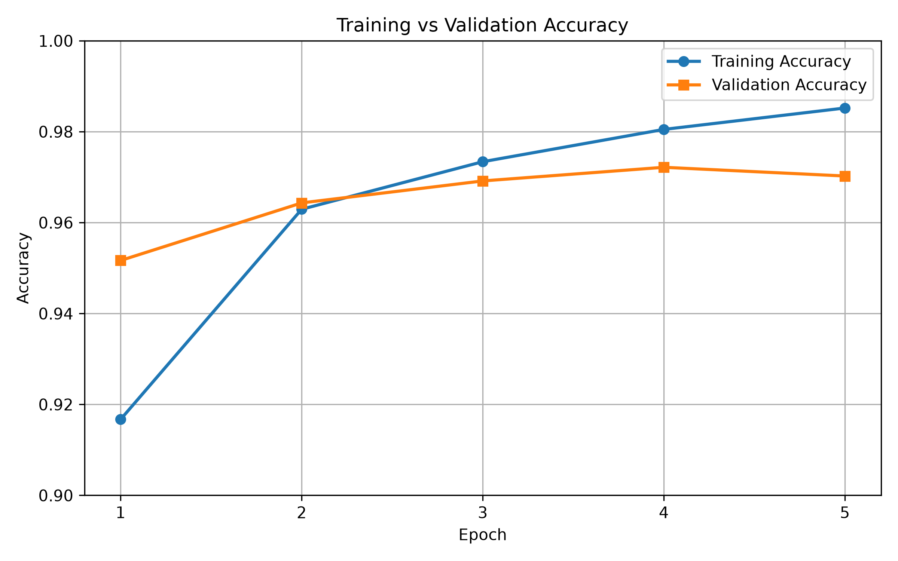
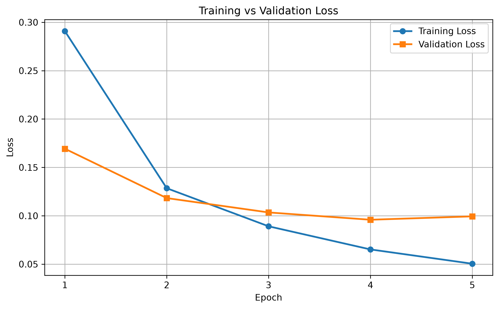

# Handwritten Digit Classification using Artificial Neural Network (ANN)

## Project Overview

This project implements a Handwritten Digit Classification system using an Artificial Neural Network (ANN) built with TensorFlow and Keras. The model is trained on the MNIST dataset to recognize handwritten digits (0–9).

---

## Features

- MNIST dataset preprocessing
- Image normalization
- ANN model built using TensorFlow/Keras
- Model training with validation
- Model evaluation
- Model saving and loading
- Training Accuracy visualization
- Training Loss visualization
- Random digit prediction using saved model

---

## Project Structure

```
mnist-digit-classification-ann/

├── train.py
├── predict.py
├── models/
│   └── model.keras
├── images/
│   ├── training_accuracy.png
│   └── training_loss.png
├── requirements.txt
├── README.md
└── .gitignore
```

---

## Technologies Used

- Python
- TensorFlow
- Keras
- NumPy
- Matplotlib

---

## Dataset

MNIST Dataset

- 60,000 Training Images
- 10,000 Test Images
- Image Size: 28 × 28 pixels
- Classes: 10 (Digits 0–9)

---

## Model Architecture

- Input Layer (28×28)
- Flatten Layer
- Dense Layer (128 ReLU)
- Output Layer (10 Softmax)

---

## Training Configuration

- Optimizer: Adam
- Loss Function: Categorical Crossentropy
- Epochs: 5
- Batch Size: 32
- Validation Split: 20%

---

## Results

Test Accuracy: **97.6%**

---

## Training Accuracy



---

## Training Loss



---

## Run Project

Train Model

```bash
python train.py
```

Predict Digit

```bash
python predict.py
```

---

## Future Improvements

- CNN-based digit classifier
- Streamlit web application
- Custom handwritten image prediction
- Hyperparameter tuning